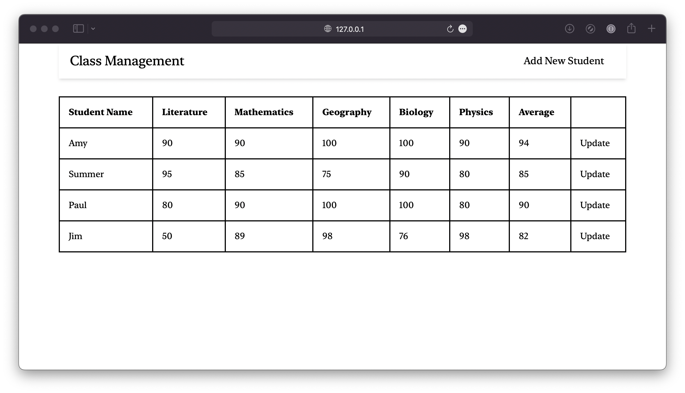

# Class Management App

A class management application, created to demonstrate Laravel's task scheduling functionality.

**Tutorial**: [Laravel scheduled tasks]().



## 🟢 Prerequisites

You must have the latest version of [PHP](https://www.php.net/) and [Composer](https://getcomposer.org/) installed on your machine. This project is tested against PHP 8.1.6.

## 📦 Getting started

First, create a new working directory and `cd` into it:

```command
mkdir class-management-app && cd class-management-app
```

Clone the project using the following command:

```command
git clone https://github.com/betterstack-community/class-management-app.git
```

Rename the `.env.example` file into `.env`:

```command
mv .env.example .env
```

Generate a new `APP_KEY` by running the following Artisan command:

```command
php artisan key:generate
```

Open the `.env` file and edit the path to the `.sqlite` database based on your system:

```text
[label .env]
. . .
DB_CONNECTION=sqlite
DB_DATABASE="<absolute_path_to>/database.sqlite"
DB_FOREIGN_KEYS=true
```

And finally, start the dev server:

```command
php artisan serve
```

Open your browser and go to [http://127.0.0.1:8000](http://127.0.0.1:8000). You should see the home page of the class management app.

## ⚖ License

The code used in this project and in the linked tutorial are licensed under the [Apache License, Version 2.0](LICENSE).
